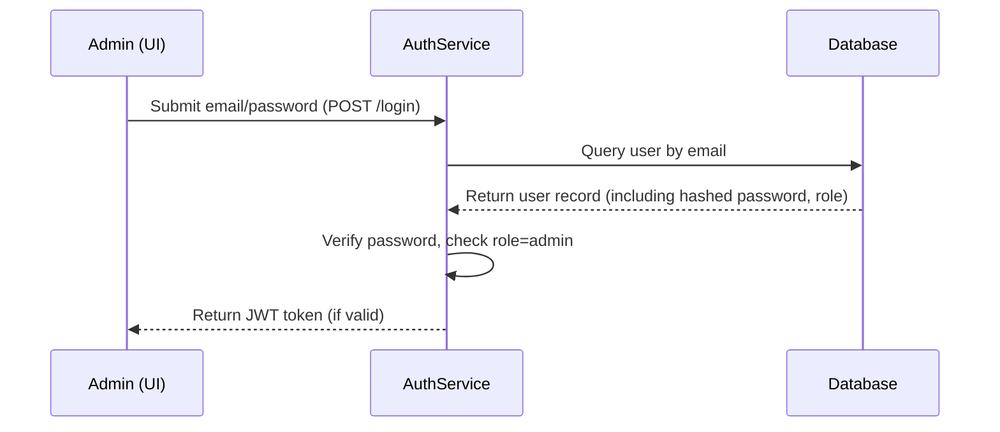
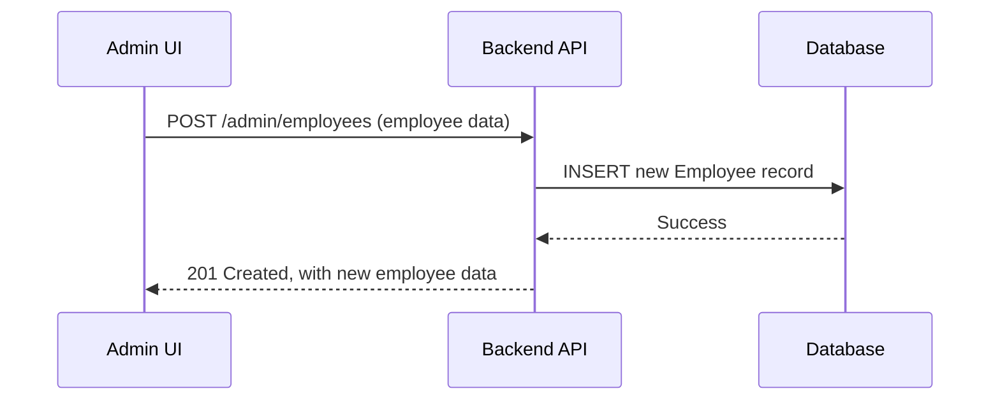
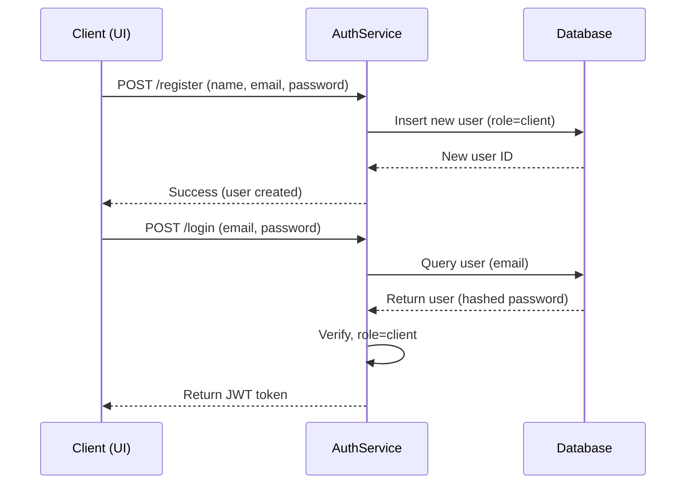
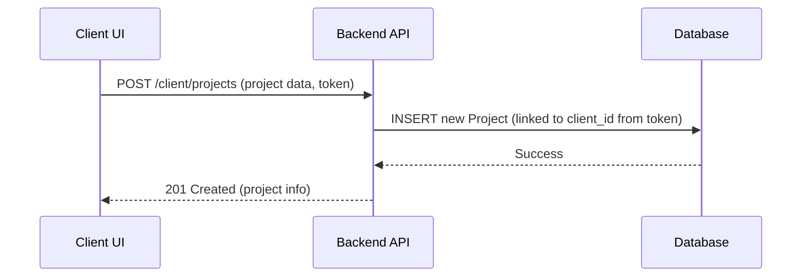
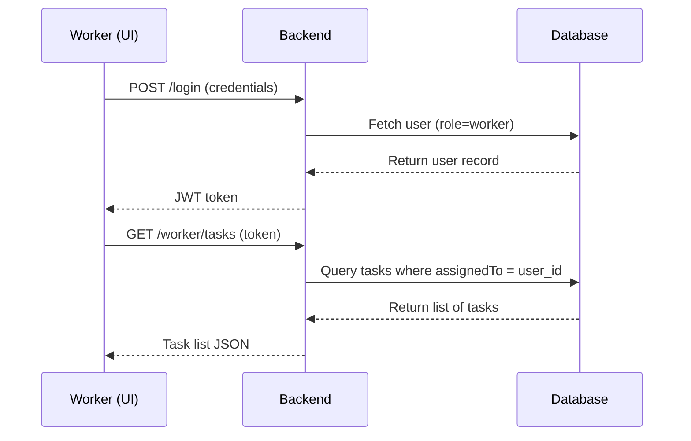
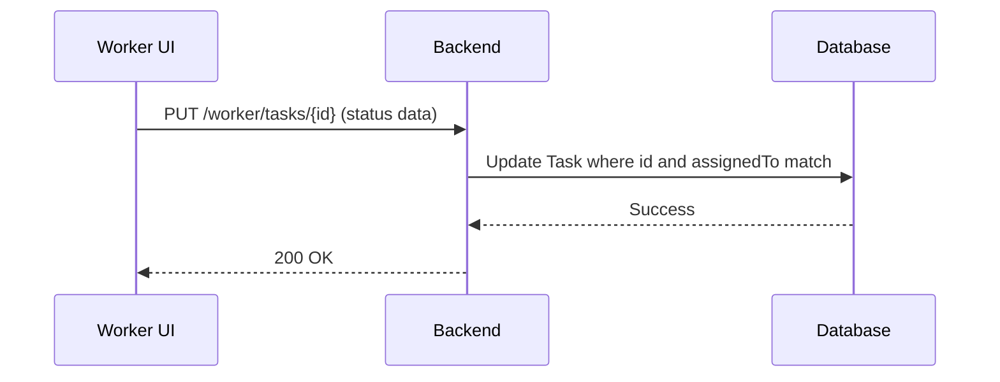
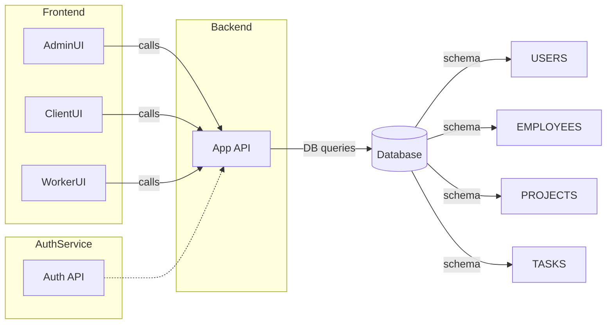

# Executive Summary  
This report details the product and technical requirements, implementation plan, UI/UX and application flows, data models, and team integration strategy for the **“Ripal Design”** project (roles: Admin/Yash, Client/Rachit, Worker/Rajibul, with a shared Employees module). The Product Requirements Document (PRD) and Technical Requirements Document (TRD) are tailored per role, yet aligned on common components (e.g. authentication, employee data). Each role’s section includes scope, user stories with acceptance criteria, data model (ER diagrams), API endpoints (CRUD/auth/role-based), sequence and flow diagrams (Mermaid), UI/UX mapping, non-functional requirements (NFRs), testing plan, deployment steps, and time estimates with milestones. An integrated team plan and handoff checklist are provided at the end. Key practices are followed: PRDs define *why* and *what* (purpose, features, goals, success criteria), TRDs cover *how* (functional + non-functional requirements, technical specifications, constraints, acceptance tests), and implementation plans detail tasks, responsibilities, and timeline. All deliverables prioritize clarity, alignment with Figma screens, and agile adaptability (noting any Figma ambiguities as assumptions).

## Team Roles & Responsibilities (Summary)  
| **Role / Team Member** | **Primary Focus**            | **Key Responsibilities**                                                                       | **Deliverables**                         |
|-----------------------|-----------------------------|----------------------------------------------------------------------------------------------|------------------------------------------|
| **Yash (Admin)**      | Admin Dashboard & Management| Design and implement admin interfaces: employee management, reporting, system settings.       | PRD/Admin screens, TRD, implementation tasks, admin flows, APIs, DB schema, tests. |
| **Rachit (Client)**   | Client Portal & Login       | Design and implement client-facing features: login/registration, project management, tasks.   | PRD/Login+Client, TRD, implementation tasks, client flows, APIs, DB extensions, tests. |
| **Rajibul (Worker)**  | Worker Portal               | Design and implement worker features: login, view/update assigned tasks, timesheets.         | PRD/Worker, TRD, implementation tasks, worker flows, APIs, DB links, tests. |
| **All (Shared)**      | Employees Module            | Jointly design core Employee entity and authentication; integrate role-based access control. | ER diagram, user auth design, integration plan, delivery checklist. |

   
## Yash (Admin) – Admin Interface

### Executive Summary  
As the admin lead, Yash will develop the **Admin Module**, including admin authentication, dashboard, and management screens (employees, roles, reports, settings). The PRD focuses on features like employee CRUD, role assignment, and reports. The TRD specifies the admin-specific functionalities, data schema, and APIs. The implementation plan outlines tasks (UI, backend, integration), timeline, and dependencies. UI flows map to Figma’s admin screens (e.g. Admin Dashboard, Employee List/Edit). The employees module (shared) is integrated, defining tasks split with Rachit/Rajibul.

### Scope  
- **In-Scope:** Admin login/session management; Employee management (create/edit/delete/view employees); Role management; System dashboards/reports; Integration with shared “Employees” module; Security and access control for admin users; API endpoints for admin tasks.  
- **Out-of-Scope:** Client-side project tasks, worker-specific workflows; External integrations not depicted in Figma.

### User Stories  
- **Admin Authentication:** “As an **Admin**, I want to securely log in to the system, so that I can access the admin interface and manage the application.”  
- **Employee Management:** “As an **Admin**, I want to create, view, update, and deactivate employee records, so I can manage my workforce.”  
- **Role Assignment:** “As an **Admin**, I want to assign or change roles for employees (admin, worker, client), so that users have appropriate permissions.”  
- **Dashboard/Reports:** “As an **Admin**, I want to view dashboards/reports (e.g. employee count, active tasks), so that I can monitor system usage.”  
- **Out-of-Scope / Assumptions:** Figma’s admin screens may not show every feature (e.g. reports/analytics). We assume standard admin reports (employee headcount, recent activities) and note these as assumptions.

### Acceptance Criteria  
- **Admin Login:** Given valid admin credentials, when submitted, then admin is authenticated and redirected to admin dashboard; invalid credentials show an error.  
- **Employee CRUD:** Given a filled employee form, when I save, then the employee is added to the system and visible in the employee list; edits and deletions update the database accordingly.  
- **Role Change:** Given an employee record, when I change the role (admin/worker/client) and save, then the user’s permissions update and reflect on login.  
- **Dashboard Widgets:** Given the system has data, the dashboard displays correct counts (e.g. total employees) and latest activities; all links on dashboard navigate correctly.  

### Data Model (ER Diagram)  
The core data model includes **User**, **Employee**, **Role**, **Task**, and **Project** (see ER diagram below). Users have roles (admin/client/worker) and are associated with employee or client records. Admins manage employees and view reports.  

```mermaid
erDiagram
    USER ||--|{ EMPLOYEE : has
    USER ||--|{ CLIENT   : manages
    USER ||--|{ TASK     : assigns
    ROLE ||--|{ USER     : grants
    EMPLOYEE ||--o{ TASK  : "performs"
    CLIENT   ||--|{ PROJECT: "owns"
    PROJECT  ||--|{ TASK   : includes

    USER {
      int id PK
      string name
      string email
      string passwordHash
      int role_id FK
    }
    ROLE {
      int id PK
      string name
    }
    EMPLOYEE {
      int id PK
      string name
      string position
      string department
      int user_id FK
    }
    CLIENT {
      int id PK
      string name
      string company
      string contactEmail
      int user_id FK
    }
    PROJECT {
      int id PK
      string title
      string description
      int client_id FK
    }
    TASK {
      int id PK
      string title
      string status
      date dueDate
      int assignedTo FK  // User/Employee
      int project_id FK
    }
```

This ER diagram highlights relationships: each **User** has one **Role**; an **Employee** record links to a User; **Clients** and **Tasks** relate to Users (admin and worker); **Projects** belong to Clients and contain Tasks.  

### API Endpoints (Admin)  
Common RESTful endpoints (all under `/api/admin` or similar) with JSON requests:
- **POST** `/api/auth/login` – Authenticate user (returns JWT token). (Shared)  
- **GET/POST/PUT/DELETE** `/api/admin/employees` – CRUD operations on employees; only accessible by admin role (role-based access).  
- **GET/POST/PUT/DELETE** `/api/admin/roles` – Manage roles (optional if roles are static, else for extensibility).  
- **GET** `/api/admin/reports/summary` – Fetch summary data (employee count, active tasks).  
- **Authentication / Authorization:** All admin endpoints require a valid JWT with role=admin (or use OAuth2 with role scopes).  

### Sequence Diagrams / Flows  
**Admin Login Flow (sequence):**  



**Employee Management Flow:**  



These illustrate admin authentication and creating an employee. Similar flows apply for updating or deleting employees (PUT/DELETE endpoints).

### UI/UX Flow (Mapping to Figma)  
Based on the Figma “Ripal Design” file (node-id=19-20) for admin screens (assumed):
- **Login Screen:** Admin enters credentials; on success redirects to **Admin Dashboard**.
- **Admin Dashboard:** Shows metrics (total employees, tasks etc.) and navigation (Employees, Roles, Reports).
- **Employees List:** Table of employees with add/edit/delete buttons (Figma screens likely show list and edit forms).  
- **Employee Form:** Fields (Name, Position, Role, Department); save/cancel.  
- **Reports Screen:** Charts or stats (assumed, if not explicit).  

*Assumptions:* Figma may not explicitly show all pages (e.g. Role management, Reports). We assume standard admin pages for these features where necessary.

### Non-Functional Requirements (NFRs)  
- **Security:** Only admin users can access admin routes; enforce HTTPS, protect JWT tokens.  
- **Performance:** Employee list and search should load under 2s; dashboard queries optimized (indexes on key fields).  
- **Scalability:** Design APIs statelessly; plan for many employees (vertical scaling or pagination on lists).  
- **Maintainability:** Follow coding standards; use automated tests and CI/CD.  
- **Usability:** Admin UI must be responsive; follow Figma design for consistency; keyboard-friendly forms.  
- **Reliability:** Aim for 99.9% uptime; logs/monitoring for failures.  

*(NFRs reflect TRD guidelines for performance, security, scalability, accessibility.)*

### Testing Plan  
- **Unit Tests:** For backend (e.g. controllers/services for employee CRUD) and frontend (components).  
- **Integration Tests:** Verify API endpoints with database (e.g. create employee, retrieve list).  
- **Authentication Tests:** Ensure login works only for admins, JWT token validation.  
- **UI Tests:** Automated tests (Selenium/Puppeteer) for admin flows (login, create employee).  
- **Performance Tests:** Load test employee list with large dataset.  
- **Security Tests:** Check common vulnerabilities (OWASP top 10) on admin routes.

### Deployment Steps  
- **Dev Environment:** Developers run locally or using Docker compose (services: web API, database).  
- **CI/CD Pipeline:** On commit to `main`, run unit tests and build. Merge triggers deployment to staging.  
- **Staging:** Deploy to staging server (with DB migration scripts, environment variables). Run integration tests.  
- **Production:** After approval, deploy via blue/green or rolling updates (ensuring zero downtime).  
- **Environment Parity:** Keep dev/staging/prod configs aligned (e.g. same DB engine/version).  
- **Rollback Plan:** Ensure quick rollback via previous container image or DB snapshot if issues appear.

### Effort Estimate & Milestones  
- **Design & Setup (16h):** Review requirements, design ERD and API.  
- **Authentication (8h):** Implement JWT auth and role checks.  
- **Employee Module Backend (24h):** CRUD APIs, database schema (includes shared work with others on Employee table).  
- **Employee Module Frontend (24h):** UI pages/forms for employee management.  
- **Dashboard & Reports (16h):** Build admin dashboard pages, simple report queries.  
- **Testing & Integration (12h):** Unit/integration tests, code review, merge integration.  
- **Buffer & Review (8h).**  
- **Total:** ~108 person-hours.  
- **Milestones:** Authentication done by Week 1; Employee CRUD (backend+UI) by Week 2; Dashboard/Reports by Week 3; Testing & fix by Week 4.

## Rachit (Login + Client Portal)

### Executive Summary  
Rachit will build the **Client Module**, covering user authentication (signup/login) and client-specific features such as project/task management. The PRD outlines user stories for onboarding and client use cases. The TRD details the necessary APIs, data models, and constraints for client entities. The implementation plan covers tasks (login flow, project CRUD, UI screens) and timeline. UI/UX flows link to Figma screens (e.g. Client Dashboard, Project list). Since the Employees module is shared, Rachit and Yash coordinate on the common schema (User/Employee tables) and endpoints. The login feature is shared with workers, so Rachit ensures a robust auth flow.

### Scope  
- **In-Scope:** User registration and login (shared by clients and workers); Client dashboard; Project and task management (create/edit projects and tasks under client account); Integration with shared Employee and Task modules (e.g. assigning tasks to employees); Role-based permissions (client only sees own data).  
- **Out-of-Scope:** Admin features (handled by Yash), worker’s task update (handled by Rajibul).  
- **Assumptions:** Figma shows client area screens for login, project lists, etc. If specifics missing, assume typical client portal (projects and tasks).

### User Stories  
- **Client Signup/Login:** “As a **Client**, I want to register an account (or log in), so I can access the client portal.”  
- **View Projects:** “As a **Client**, I want to see a list of my projects, so I can manage them.”  
- **Create Project:** “As a **Client**, I want to create new projects with details (title, description), so I can submit new work for my company.”  
- **Assign Tasks:** “As a **Client**, I want to create and assign tasks (or work orders) to available employees, so I can delegate work.”  
- **View Employee Availability:** “As a **Client**, I want to see which employees (workers) are available, so I can assign tasks appropriately.”  
- **Out-of-Scope:** Payment or billing (not indicated in Figma), user profile edits (basic login only assumed).

### Acceptance Criteria  
- **Registration/Login:** Given valid details, when client registers or logs in, then account is created/authenticated and token is issued; invalid data yields errors.  
- **Project CRUD:** Given project data, when client creates or edits a project, then project appears in their project list; deletion removes it.  
- **Task Assignment:** Given project and employee selection, when assigning a task, then the task record is created and viewable by admin/worker.  
- **Permissions:** A client can only view/edit their own projects/tasks; accessing others’ data returns “forbidden”.  

### Data Model  
Expanding the shared model, we focus on **User**, **Client**, **Project**, and re-use **Task** and **Employee** (from admin). Each Client links to a User record for login. Projects belong to a client. Tasks (work orders) can be created by a client for employees.

(ER Diagram is as shown above; no changes necessary beyond noting relationships.)
- **User** – holds auth info (re-used).  
- **Client** – FK to User, with business details.  
- **Project** – FK to Client, with title/desc.  
- **Task** – FK to Project and assigned Employee/User.  

### API Endpoints (Client)  
- **POST** `/api/auth/register` – Create new user (with role=client).  
- **POST** `/api/auth/login` – Authenticate and return token (shared).  
- **GET/POST/PUT/DELETE** `/api/client/projects` – Manage client’s projects (client role only).  
- **GET/POST/PUT/DELETE** `/api/client/tasks` – Manage tasks under client projects. (Alternatively, tasks might be nested under projects in URI.)  
- **GET** `/api/client/employees` – List available employees (for task assignment). Filter by availability/status.  
- **Authentication:** All under JWT/OAuth; only logged-in clients (role=client) can call these.  

### Sequence Diagrams / Flows  
**Client Login/Registration Flow:**  



**Project Creation Flow:**  



### UI/UX Flow (Mapping to Figma)  
Based on Figma (node-id=19-20, & relevant screens):
- **Login/Registration Page:** Client signs up or logs in.  
- **Client Dashboard:** Shows client projects, “Create Project” button, maybe summary of tasks.  
- **Project List Page:** Table or cards of projects; each links to project details.  
- **Project Detail / Task List:** For a selected project, list of tasks with status. “Add Task” button to assign new tasks to employees.  
- **Task Form:** Fields for task title, description, select employee from a dropdown.  
- *Assumptions:* Figma may show some of these; if not fully specified, we assume standard project/task pages.

### Non-Functional Requirements  
- **Security:** Protect client data; enforce that clients can only access their own projects (role-based rules). Encrypt passwords, use HTTPS.  
- **Performance:** Project/task list pages load <2s for 100 projects; use pagination if needed.  
- **Scalability:** API stateless; support many clients and projects (horizontal scaling possible).  
- **Maintainability:** Shared modules (auth, employee lookup) reused; code organized by domain (client).  
- **Usability:** Simple, intuitive forms (per Figma design); mobile-friendly layout.  
- **Reliability:** Proper error handling (e.g. invalid data), logging for debugging.  

### Testing Plan  
- **Unit Tests:** For registration/login logic; project/task services.  
- **Integration Tests:** Verify API endpoints (e.g. client cannot access another client’s project).  
- **UI Tests:** Automated tests for client login, project creation, and task assignment.  
- **Security Tests:** Test that endpoints reject wrong-role requests.  
- **Acceptance Tests:** E.g. use scenarios from user stories to verify end-to-end (BDD style).

### Deployment Steps  
- **Authentication Service:** Deploy shared auth endpoints first (JWT library, user DB).  
- **Feature Flags:** Possibly use feature toggles to enable client features gradually.  
- **CI/CD:** Unit tests on commit; on merge, deploy client app to staging.  
- **Staging Verification:** Verify client login, project creation; run smoke tests.  
- **Production:** Deploy with database migrations (Projects, Clients tables).  
- **Rollback:** Ensure previous migration backups; monitor any errors closely.  

### Effort Estimate & Milestones  
- **Design & Setup (12h):** Refine client data schema, auth integration.  
- **Auth Implementation (8h):** Registration and login endpoints (reuse shared auth).  
- **Projects Backend (20h):** CRUD APIs for projects; DB schema (Projects table).  
- **Tasks Backend (16h):** APIs for tasks (create/assign to employees).  
- **Frontend (Client Portal) (24h):** Pages for login, project list, project detail, task creation.  
- **Shared Employee Lookup (8h):** Endpoint to fetch employees for dropdowns.  
- **Testing & QA (8h):** Automated tests, integration.  
- **Total:** ~96 person-hours.  
- **Milestones:** Auth and basic portal by Week 1; Project CRUD by Week 2; Task assignment by Week 3; Testing & polish by Week 4.

## Rajibul (Worker Interface)

### Executive Summary  
Rajibul is responsible for the **Worker Module**, enabling workers to log in and manage their tasks. The PRD focuses on worker use cases (view/update tasks, timesheet). The TRD covers APIs for workers to fetch and update assigned tasks, and any worker-specific data. The implementation plan outlines building the login flow (shared) and worker dashboards, coordinating with Yash on the shared Employee model. UI flows correspond to Figma’s worker screens (Task List, Task Details). Non-functional requirements and testing similar to other roles, with emphasis on data privacy and performance for mobile or on-site use.

### Scope  
- **In-Scope:** Worker login (shared), view list of assigned tasks, update task status (e.g. mark completed), possibly timesheet or work logs. Integration with “Tasks” entity (shared).  
- **Out-of-Scope:** Admin or client management features.  
- **Assumptions:** Figma likely includes screens for worker login and task list. If timesheet or other features are not clear, assume tasks and status updates only.

### User Stories  
- **Worker Login:** “As a **Worker**, I want to log in to see my assignments, so I can start my work.”  
- **View Tasks:** “As a **Worker**, I want to view my list of tasks with details (project, due date, description), so I know what to do.”  
- **Update Task Status:** “As a **Worker**, I want to update the status of a task (e.g. In Progress, Completed), so the system and admin are informed.”  
- **View Schedule:** (If applicable) “As a **Worker**, I want to see my schedule or timesheet summary.” (Not in Figma explicitly; assume optional.)

### Acceptance Criteria  
- **Login/Authentication:** (Same as client) valid worker logs in and receives token; invalid login is rejected.  
- **Task List:** After login, the worker sees a list of tasks assigned to them (from DB), showing title, project, status.  
- **Status Update:** Given a task, when worker marks it complete or changes status, the update is saved and visible in admin/client interfaces.  
- **Unauthorized Access:** Worker cannot access other users’ tasks or admin pages.

### Data Model  
No new entities beyond **User**, **Employee**, **Task** are needed. Each Task has `assignedTo` referencing a User/Employee who is a worker. Workers are a subset of Users with role=worker and linked Employee records. We use the same model as above.

### API Endpoints (Worker)  
- **POST** `/api/auth/login` – (Shared) authenticate user (worker).  
- **GET** `/api/worker/tasks` – Get tasks assigned to the logged-in worker.  
- **PUT** `/api/worker/tasks/:id` – Update task status or details (worker can only update their own tasks).  
- **Authentication:** Only allow role=worker for these endpoints.  

### Sequence Diagrams / Flows  
**Worker Login and Task Retrieval:**  



**Task Status Update:**  



### UI/UX Flow (Mapping to Figma)  
From the Figma project (assumed worker screens):
- **Worker Login Page:** Worker enters credentials (same as client).  
- **Task List Page:** After login, a list of tasks assigned to the worker (title, due date, status).  
- **Task Detail/Status Page:** On selecting a task, worker sees full details (project name, description) and can change status (e.g. dropdown or buttons).  
- **Timesheet (optional):** If Figma shows it, workers can view logged hours; otherwise, skip.  

### Non-Functional Requirements  
- **Security:** Ensure only authenticated workers can see their tasks. JWT tokens validated on each request.  
- **Performance:** Loading tasks should be fast (<2s) even with many tasks (pagination or lazy load if needed).  
- **Scalability:** API stateless, support adding more workers/users seamlessly.  
- **Maintainability:** Share code with admin/client where possible (e.g. common UI components).  
- **Usability:** Simple, mobile-friendly UI (workers may use phones/tablets on site).  
- **Reliability:** Offline mode (if needed) not specified; assume online use.

### Testing Plan  
- **Unit Tests:** For task-retrieval logic (e.g. filtering by worker), and status-update handling.  
- **Integration Tests:** Verify tasks API returns only correct tasks for authenticated worker.  
- **UI Tests:** Automated flows: login, view tasks, update status.  
- **Edge Cases:** Attempt to update others’ tasks (should fail); network loss handling (basic error messages).  

### Deployment Steps  
- **Auth Sharing:** Reuse login endpoint. No new migrations needed (Tasks table already has `assignedTo`).  
- **CI/CD:** Tests for worker APIs and UI. Deploy worker front-end after client/admin is stable.  
- **Smoke Testing:** On staging, login as a worker and perform basic actions to verify integration with client/admin.  
- **Production:** Release together with client/admin; monitor specifically worker endpoints.  

### Effort Estimate & Milestones  
- **Login Integration (4h):** Ensure worker login is configured and tested.  
- **Task APIs (12h):** Implement endpoints to fetch and update tasks.  
- **Frontend (Task UI) (16h):** Build task list and detail pages.  
- **Integration (8h):** Tie with shared Employee/Task modules; ensure role filtering.  
- **Testing & Fixes (8h):** Automated tests, bug fixes.  
- **Total:** ~48 person-hours.  
- **Milestones:** Task API by Week 1; UI implementation by Week 2; testing by Week 3.

## Integration Plan and Handoff

### Shared Employees Module  
- **Schema Agreement:** Yash, Rachit, and Rajibul collaborate on the **User/Employee** tables. Agree that every worker and admin is a User+Employee; every client is a User+Client.  
- **APIs Coordination:** Authentication (`/auth/login`) is shared. Design an authentication service layer used by all modules.  
- **Integration Points:** 
  - **Employee Data:** Employee CRUD (Yash) and employee lookup (Rachit’s task assignment, Rajibul’s task list) use the same DB table. Define clear API contracts (e.g. `/api/admin/employees` for admin vs `/api/client/employees` read-only).  
  - **Tasks and Projects:** Tasks created by clients will involve employees (assignedTo), so Yash’s and Rajibul’s code must work with tasks data. Yash should include tasks in employee reports if applicable.  
- **Version Control:** Use a shared repository (or monorepo) with branches per feature. Each dev reviews others’ schemas to avoid conflicts.  
- **Regular Syncs:** Schedule frequent check-ins to resolve schema/API mismatches.

### Handoff Checklist  
- [ ] **Documentation:** Each developer writes up README and API docs for their module (endpoint specs, data models).  
- [ ] **Code Repositories:** Ensure code is pushed to common repo; implement CI with testing pipelines.  
- [ ] **Environment Setup:** Provide configuration scripts/Dockerfiles for local dev.  
- [ ] **Shared Libraries:** Extract common code (auth, database models) into shared modules.  
- [ ] **User Acceptance Test (UAT) Steps:** List how to verify key flows (login, employee CRUD, etc.).  
- [ ] **Deployment Configuration:** Document environment variables, secrets (JWT secret), and deployment procedure for each service.  
- [ ] **Training:** Quick walkthrough for Ops/QA on using the system and running tests.  

### Timeline & Milestones (Team-wide)  
| **Phase**            | **Tasks**                                       | **Duration** | **Due**        |
|----------------------|--------------------------------------------------|------------|----------------|
| **Week 1**           | Auth service + Login flows (all roles) | 1 week     | Oct 1, 2026    |
| **Week 2**           | Employee & Project APIs (Yash/Rachit)            | 1 week     | Oct 8, 2026    |
| **Week 3**           | Admin UI and Client UI completed                 | 1 week     | Oct 15, 2026   |
| **Week 4**           | Worker UI + Integration testing                  | 1 week     | Oct 22, 2026   |
| **Week 5**           | End-to-end testing, bug fixes, documentation     | 1 week     | Oct 29, 2026   |

**Responsibilities Table:**  

| **Deliverable/Area**         | **Yash (Admin)**            | **Rachit (Client)**             | **Rajibul (Worker)**         |
|-----------------------------|-----------------------------|--------------------------------|------------------------------|
| **Authentication (Shared)**  | Assist/integrate. Admin login only. | Implement registration/login, coordinate with auth. | Use shared login flow.       |
| **Employees Module**         | Define schema, CRUD APIs, UI.    | Integrate employee data (read-only for assignment).    | Read tasks assigned to employee. |
| **Projects Module**          | N/A                         | Backend APIs, UI for projects.  | N/A                          |
| **Tasks Module**             | Include tasks in reports.    | Create/assign tasks endpoints.  | Fetch/update tasks endpoints. |
| **UI/UX Flows**              | Admin dashboard, employee pages. | Client dashboard, project/task pages. | Worker task list and status UI. |
| **Data Model**               | Leads ER design; set up DB schemas. | Adds client/projects tables to schema. | Contributes by defining worker relations. |
| **Non-functional**           | Performance/security (server). | Security (data access), UX.      | Mobile-friendly UI, reliability. |
| **Testing**                  | Unit/Integration of admin features. | Unit/Integration of client features. | Unit/Integration of worker features. |
| **Deployment**               | Setup CI/CD for admin services.   | Setup CI/CD for client portal.  | Setup CI/CD for worker portal. |

**Integration Plan (Mermaid Flow):** Core interaction between modules:  



This diagram shows all front-ends (AdminUI, ClientUI, WorkerUI) interacting with the same backend APIs and database (with appropriate role checks).

## Key Practices and References  
- **Product Requirements (PRD):** A PRD outlines **purpose, goals, features, and user needs** of each role’s module. We ensure clarity on what to build (e.g. “what admin needs vs. client needs”), and explicitly document **assumptions** for any unspecified Figma details. User stories and acceptance criteria derive directly from the PRD.  
- **Technical Requirements (TRD):** The TRD includes functional requirements (described above by user stories and APIs) and non-functional requirements (performance, security, scalability, etc.). We follow TRD templates: Project Overview, Functional/NFRs, Technical specs (APIs, DB), constraints, and acceptance criteria.  
- **Implementation Plan:** We break the work into tasks with assigned owners and timeline, bridging strategy to execution. Each deliverable (API, UI, tests) has estimated effort and a milestone date. Responsibilities are clearly divided (see tables above).  
- **CI/CD & Deployment:** We adopt best practices: “automate everything” (tests, deployment); maintain parity across environments; use strategies like blue/green or canary for safe releases. The plan includes running smoke tests post-deployment, and tracking KPIs (e.g. response times).  
- **Security:** Use JWT-based auth with role claims. All sensitive endpoints enforce role-based access. We treat auth as a central service.  
- **Documentation:** All APIs will be documented (e.g. OpenAPI spec) so team handoff is smooth.

This comprehensive plan ensures that each team member (Yash, Rachit, Rajibul) has clear deliverables and that all pieces integrate smoothly. By anchoring design to the Figma screens (for UI flows) and to recognized best practices (for PRDs/TRDs/CI), we align on purpose and execution. Each section above is tied to authoritative guidelines (Atlassian for PRDs and plans, and technical writing standards for requirements) to ensure the project is well-specified and robust. 

